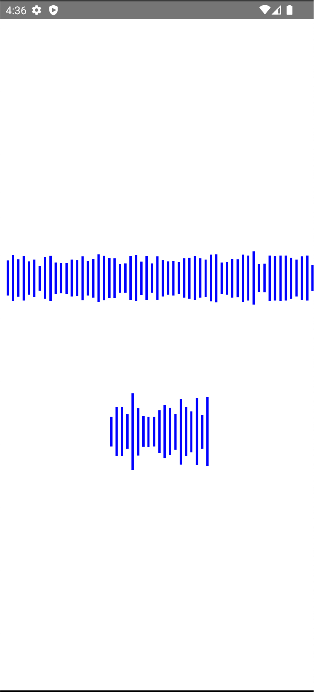
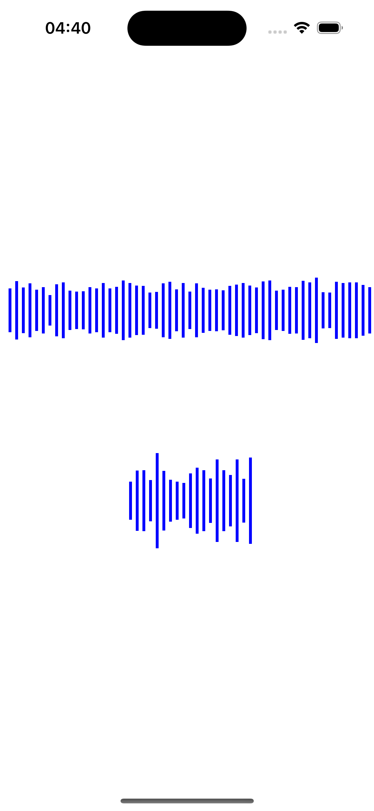

# react-native-audio-analyzer 🎵

A powerful library designed for React Native to visualize audio tracks, extract amplitude data, and create stunning audio waveforms.

This package offers robust tools that enable developers to process audio files efficiently, obtaining amplitude arrays for in-depth analysis or creating visually appealing audio waveforms within React Native applications.

## Installation 🚀

```sh
yarn add react-native-audio-analyzer
cd ios && pod install
```

## Create Stunning Audio Waveforms 🌊

With this library, unleash creativity by generating captivating audio waveforms from your audio tracks, providing an engaging visual representation of sound.

<p float="left">
  
  
</p>

## Features ✨

- __Audio Analysis__: Easily analyze audio tracks to obtain amplitude data for visualization or analysis purposes.

- __Flexible Visualization__: Visualize amplitude data in a customizable manner, allowing developers to create diverse representations based on audio characteristics, including stunning audio waveforms.

- __Sample and Scale Data__: Utilize functions to sample and scale amplitude data, providing more granular control over visualization output.

- __Platform Compatibility__: Compatible with both Android and iOS platforms, ensuring a consistent experience across devices.


## Usage 🎶

```js
import React, { useState } from 'react';

import { Alert, ScrollView, StyleSheet, View } from 'react-native';
import { analyzeAudio, scale, sample, AmplitudeData } from 'react-native-audio-analyzer';

export default function App() {
  const [result, setResult] = useState<AmplitudeData[]>([]);

  useEffect(() => {
    analyzeAudio('<uri to audio file>') // Local location on disk. !Important!: You must take care of downloading the file and give the application reading permissions
      .then(res => setResult(res))
      .catch(err => {
        // handle error
      });
  }, []);

  return (
    <View style={styles.container}>
      <ScrollView horizontal style={styles.scroll}>
        <View style={styles.row}>
          {result.length > 0 && scale(result.map(_ => _.amplitude)).map((value, index) => (
            <View
              key={index}
              style={[styles.item, { height: value * 100 }]}
            />
          ))}
        </View>
      </ScrollView>
      <ScrollView horizontal style={styles.scroll}>
        <View style={styles.row}>
          {result.length > 0 && scale(
            sample(result.map(_ => _.amplitude), 20)).map((value, index) => (
            <View
              key={index}
              style={[styles.item, { height: value * 100 }]}
            />
          ))}
        </View>
      </ScrollView>
    </View>
  );
}

const styles = StyleSheet.create({
  container: {
    flex: 1,
    alignItems: 'center',
    justifyContent: 'center',
    backgroundColor: '#ffffff',
  },
  row: {
    flexDirection: 'row',
    alignItems: 'center',
    justifyContent: 'center',
  },
  scroll: {
    maxHeight: 200,
  },
  item: {
    width: 3,
    backgroundColor: 'blue',
    marginHorizontal: 2,
  },
});

```

## Contributing 🤝
We welcome [contributions](CONTRIBUTING.md)! Learn more about how to contribute to this repository by checking out our contributing guide and development workflow.

## License 📝
This project is licensed under the MIT License.

